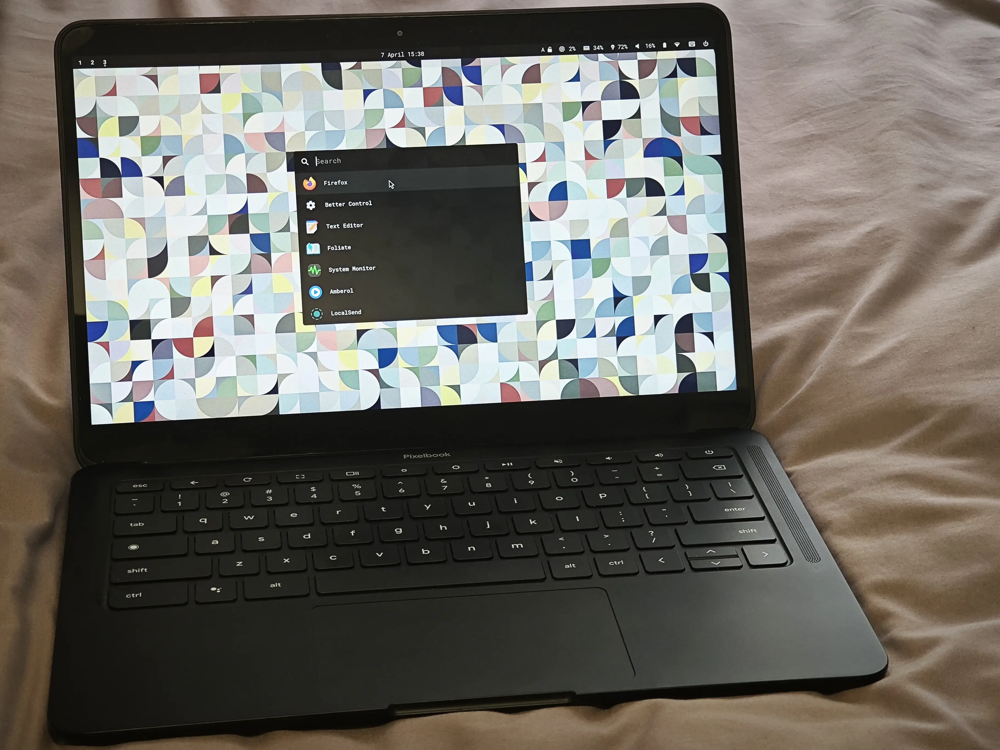
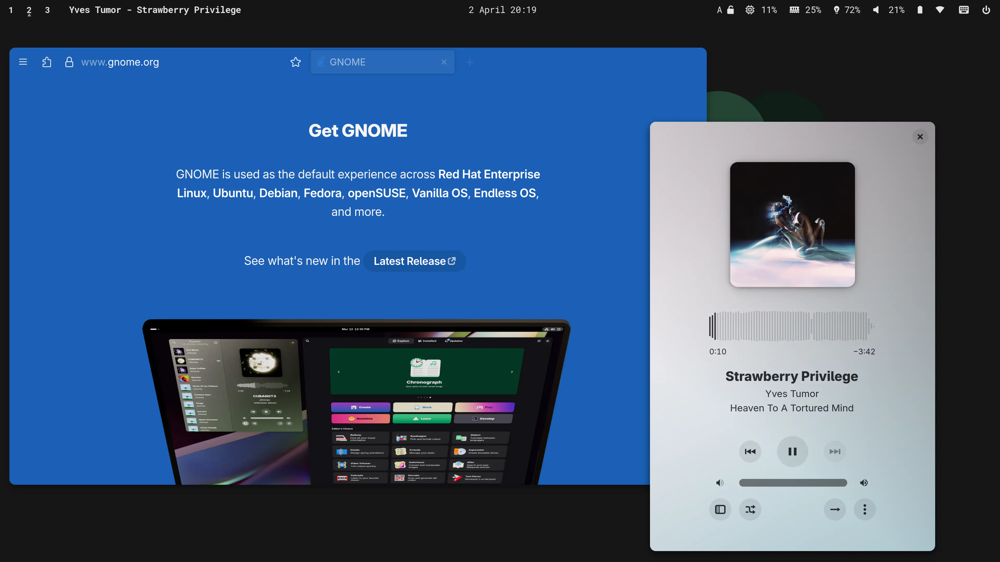

+++
title = 'Pixelbook Go'
date = 2025-04-03T10:16:13+08:00
draft = false
+++

之前我在某二手平台闲逛时，偶然发现有人正在售卖一台2019年发布的顶配Pixelbook Go。之所以对这台机器有印象，是因为当初它是同Pixel 4一起发布的，而后者至今仍是我最喜欢的一部Pixel手机。2022年，Pixelbook产品线宣告被砍，如今这样一台顶配的机器也算少见。于是我又起了折腾的心思，同卖家一番交流后，最终将这台当初售价1399美元的机器以1399人民币的价格购入。

以下是我对这台Pixelbook Go的一点测评与使用建议，供有意者参考。

## 硬件

下面是我对这台机器硬件的一些看法。

### 优点

*   13.3寸4K触摸屏，331ppi。文字显示细腻。
*   镁合金机身，1.1kg不到，便于携带。
*   无风扇设计，零噪音。
*   触摸板与键盘手感尚可，打字清脆。
*   扬声器外放效果不错。

### 缺点

*   16G内存在多数使用场景下本已够用，机器却被处理器i7-8500Y糟糕的性能所拖累，在浏览一些复杂的网页时卡顿连连。
*   256G存储，无法扩容。
*   硬件通病：许多用户在使用机器一段时间后发现转轴发紧，屏幕开合时会发出异响。喷涂润滑脂可缓解。
*   屏幕边框较大，亮度一般（约为340nit），观感偏蓝。
*   外壳易滑伤掉漆。
*   仅有两个type-c接口（均支持充电，最高45W）与1个3.5mm耳机孔。

Pixelbook Go的次顶配(i5/16+128/FHD)价格则要便宜许多，一般在七八百元左右，考虑到更为差劲的处理器和屏幕转轴的问题，有意者务必酌情购买。

## 将Pixelbook Go变为一台普通轻薄本

Pixelbook Go搭载Chrome OS，系统支持持续到2029年。虽然Chrome OS能运行Android应用和Linux虚拟机，体验往往难尽如人意。笔者之前也曾使用过某款Arm架构的Chrome OS平板设备，感觉也颇为鸡肋。好在对于Pixelbook Go这样x86架构的设备，我们可以通过几步操作，为其安装其他的操作系统。

### 刷入固件，解除系统安装限制

流程如下：

1.  开启机器的开发者模式，此为一切之前提。过程中会恢复出厂设置，注意备份已有文件。
2.  使用 [CCD](https://chromium.googlesource.com/chromiumos/third_party/hdctools/+/HEAD/docs/ccd.md)(Closed Case Debugging)解除固件刷写保护：我们需要准备一根名为SuzyQable的调试线以进行CCD。调试线可在二手平台购买，或由慷慨的卖家赠送。
3.  使用Mrchromebox提供的脚本刷入coreboot

在进行上述操作之前，请通读[Chrultabook](https://docs.chrultrabook.com/)提供的指南，并参考该[中文指南](https://hollywoo.de/posts/chrultra/)中的注意事项。若指南中有晦涩处，也可观看该[视频](https://www.bilibili.com/video/BV1fD421W7c1)熟悉完整流程。

### 安装新系统

以下是不同系统在这台机器上的表现：

*   Windows：需付费购买专用驱动以使用。
*   Linux：除摄像头外均可工作。
*   Hackintosh: 驱动不全，不推荐。

显然，Linux是最佳之选。在发行版的选择上，笔者推荐Fedora。在制作好启动盘后，系统安装过程与寻常无异。Fedora提供图形化安装界面，全程无需联网，用时不会超过20分钟。

### 后续操作

系统安装完成之后，我们需要再进行一些额外的设置以获得最佳体验。

#### 处理音频问题

如果你在安装完成后遇到音频问题，运行该[Python脚本](https://github.com/WeirdTreeThing/chromebook-linux-audio)以解决。

#### 按键重映射

安装完Fedora后，键盘顶部的功能键会被识别为F1-F10，我们可以使用社区提供的脚本还原其功能，并将Chrome OS特有的Seach和Assistant按键重映射为Caps Lock和Meta。  
  
具体操作如下：

1.  通过 copr `alternateved/keyd` 安装 [keyd](https://github.com/rvaiya/keyd)。
2.  运行该[脚本](https://github.com/WeirdTreeThing/cros-keyboard-map)设置映射。
3.  在`/etc/udev/hwdb.d/61-pixel-keyboard.hwdb`文件中加上一行 `KEYBOARD_KEY_db=capslock`。保存后运行`systemd-hwdb update`，之后重启。

上述操作用到了udev和 keyd。后者提供了更为丰富的键盘自定义功能（比如Layer, Tap-Hold），有兴趣者可自行研究。

#### 系统调校

这篇[指南](https://github.com/devangshekhawat/Fedora-41-Post-Install-Guide)罗列了安装 Fedora后的一些必做项目。考虑到Pixelbook Go处理器不堪的性能，请务必完成该指南中的视频硬件加速一项。Fedora使用Gnome作为默认的桌面环境，如果你想要一个轻量的替代，可以考虑窗口管理器[niri](https://github.com/YaLTeR/niri)，同时参考这份[说明](https://github.com/YaLTeR/niri/discussions/325#discussioncomment-11498174)进行相关配置。

## 总结

Linux最大限度地发挥了这台旧机器的使用潜力。如今我把它放在床头，偶尔用[tsukimi](https://tsukimi.tsuna.moe/)看看电影，或是打开Obsidian记两行笔记。但以实相告，使用它的乐趣远没折腾中的乐趣多。如果你只是想要买一台二手笔记本跑Linux，完全没有必要选择Pixelbook Go。

## 参考阅读

*   [Chromebook 免拆机救砖教程](https://hollywoo.de/posts/unbrick/)
*   [Keyboard remap guide](https://github.com/Alekamerlin/keyaboard-remap-guide)：一份Linux下按键重映射的简明指南。
